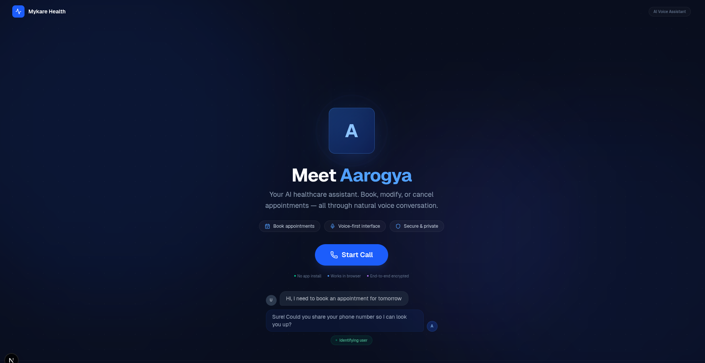
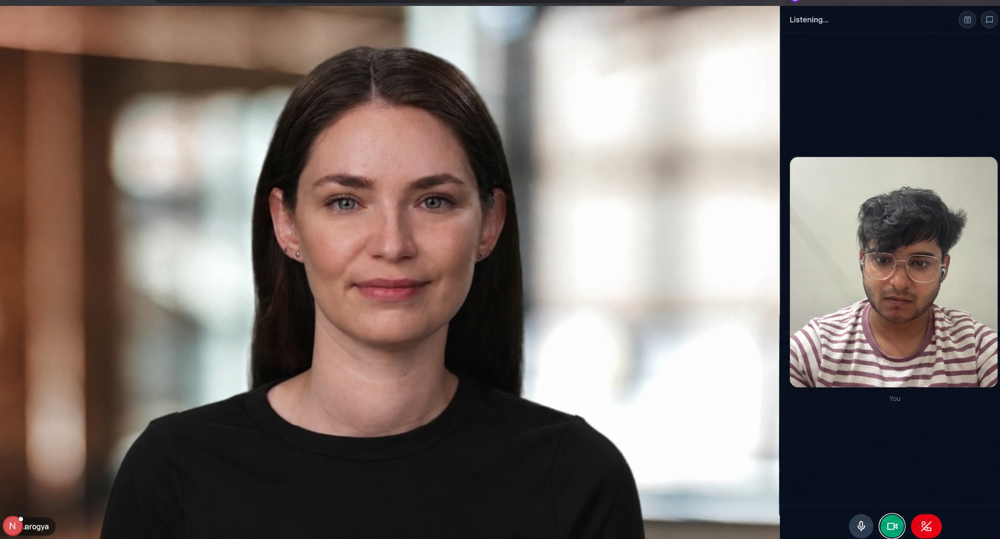

# Aarogya — Mykare Health AI Voice Assistant

<p align="center">
  
</p>

<p align="center">
  <a href="https://mykare-agent-production.up.railway.app">
    
  </a>
  
  
  
</p>

> **Your AI healthcare assistant.** Book, modify, or cancel appointments — all through natural voice conversation.

---

## What is Aarogya?

**Aarogya** (meaning "health" in Sanskrit) is a web-based AI voice agent built for **Mykare Health** that handles healthcare appointment booking end-to-end using natural voice conversations. Patients can speak to the AI, get their queries answered, book appointments, reschedule, cancel, or check their bookings — all without typing a single word.

<p align="center">
  
</p>

---

## Architecture

```
┌──────────────┐     ┌──────────────┐     ┌──────────────┐     ┌──────────────┐
│   User       │────▶│  Deepgram    │────▶│  OpenRouter  │────▶│  Cartesia    │
│   Speech     │     │    STT       │     │  LLM (Llama) │     │    TTS       │
└──────────────┘     └──────────────┘     └──────┬───────┘     └──────┬───────┘
                                                  │                    │
                                                  ▼                    ▼
                                         ┌────────────────┐   ┌──────────────┐
                                         │  Function Tools │   │  User Audio  │
                                         │  (7 tools)      │   │  (Sonic-3)   │
                                         └────────┬───────┘   └──────────────┘
                                                  │
                                                  ▼
                                         ┌────────────────┐
                                         │  SQLite DB     │
                                         │  Appointments  │
                                         └────────┬───────┘
                                                  │
                                                  ▼
                                         ┌────────────────┐
                                         │  LiveKit Data  │────▶ Frontend UI
                                         │  Channel       │      (Next.js 15)
                                         └────────────────┘
```

---

## Tech Stack

| Layer | Technology | Purpose |
|-------|-----------|---------|
| **Voice Framework** | LiveKit Agents (Python) | Real-time audio streaming |
| **STT** | Deepgram Nova-3 | Speech-to-text transcription |
| **TTS** | Cartesia Sonic-3 | Ultra-low latency text-to-speech |
| **LLM** | Meta Llama 3.1 70B (via OpenRouter) | Conversation intelligence |
| **Avatar** | Beyond Presence + CSS fallback | Photorealistic talking avatar |
| **Frontend** | Next.js 15 + React 19 + Tailwind | Patient-facing web UI |
| **Database** | SQLite + SQLAlchemy | Appointment & patient storage |
| **Deployment** | Railway (backend) + Vercel (frontend) | Production hosting |

---

## Features

### Voice-First Experience
- **Natural conversations** — 5+ back-and-forth exchanges with full context memory
- **Ultra-low latency** — Sub-600ms response time from speech-to-speech
- **Intelligent interruptions** — Barge-in support for immediate response

### AI Avatar
- **Photorealistic video** — Beyond Presence speech-synced video avatar
- **CSS fallback** — Animated breathing avatar when video is unavailable
- **Real-time lip sync** — Synchronized with Cartesia audio stream

### Appointment Management (7 Tools)
| Tool | What it does |
|------|-------------|
| `identify_user` | Look up or create patient by phone number |
| `fetch_slots` | Get available appointment slots for any date |
| `book_appointment` | Book with double-booking prevention |
| `retrieve_appointments` | List all patient appointments |
| `cancel_appointment` | Cancel by ID or date+time |
| `modify_appointment` | Reschedule or update doctor/reason |
| `end_conversation` | Generate call summary |

### Real-Time UI
- **Tool call visualization** — See every action the AI takes live
- **Transcript panel** — Full conversation history
- **Appointments panel** — View booked/cancelled appointments instantly
- **Call summary** — Generated within 10 seconds of hang-up

---

## Screenshots

### Welcome Screen
The landing experience introduces Aarogya with an animated breathing avatar and conversation preview.

<p align="center">
  
</p>

### Active Voice Call
During a call, patients see the AI avatar speaking, their own video feed, real-time tool call notifications, and can toggle between transcript and appointments view.

<p align="center">
  
</p>

---

## Quick Start

### Prerequisites
- Python 3.10+
- Node.js 20+
- pnpm

### Backend
```bash
cd backend
python -m venv .venv
source .venv/bin/activate
pip install -r requirements.txt
cp .env.example .env
# Edit .env with your API keys
python agent.py dev
```

### Frontend
```bash
cd frontend
pnpm install
cp .env.example .env.local
# Edit .env.local with LIVEKIT_URL
pnpm dev
```

Open http://localhost:3000 and click **"Start Call"**.

---

## API Keys Required

| Key | Service | Free Tier |
|-----|---------|-----------|
| `LIVEKIT_API_KEY` + `SECRET` | LiveKit Cloud | 10K min/mo |
| `LLM_API_KEY` | OpenRouter / OpenAI / Ollama | Varies |
| `DEEPGRAM_API_KEY` | Deepgram | $200 credits |
| `CARTESIA_API_KEY` | Cartesia | 20K credits (~22 min) |
| `BEY_API_KEY` (optional) | Beyond Presence | Trial available |

---

## Cost Per Call (5 min)

| Service | Cost |
|---------|------|
| Deepgram STT | ~$0.04 |
| LLM (Llama 3.1 70B) | ~$0.02 |
| Cartesia TTS | ~$0.10 |
| LiveKit Cloud | Free tier |
| Beyond Presence | ~$0.05 |
| **Total** | **~$0.21** |

---

## Deployment

### Backend — Railway
1. Create project at [railway.app](https://railway.app)
2. Add your GitHub repo
3. Set all environment variables from `.env.example`
4. Push to `master` triggers auto-deploy

### Frontend — Vercel
1. Import project at [vercel.com](https://vercel.com)
2. Set root directory to `frontend/`
3. Add `NEXT_PUBLIC_LIVEKIT_URL`, `LIVEKIT_API_KEY`, `LIVEKIT_API_SECRET`
4. Auto-deploys on every push

---

## Environment Variables

See [`backend/.env.example`](backend/.env.example) and [`frontend/.env.example`](frontend/.env.example) for full reference.

---

## Project Structure

```
mykare/
├── backend/
│   ├── agent.py              # LiveKit agent entry point
│   ├── healthcare_agent.py   # Conversation logic & tools
│   ├── slot_generator.py     # Appointment slot generation
│   ├── config.py             # Environment configuration
│   ├── db/
│   │   ├── crud.py           # Database operations
│   │   └── models.py         # SQLAlchemy models
│   └── requirements.txt
├── frontend/
│   ├── src/
│   │   ├── components/
│   │   │   ├── VoiceAgentApp.tsx   # Main call UI
│   │   │   ├── WelcomeScreen.tsx   # Landing page
│   │   │   └── AvatarDisplay.tsx   # Avatar component
│   │   ├── hooks/
│   │   │   ├── useCallSummary.ts
│   │   │   ├── useToolCalls.ts
│   │   │   └── useSTT.ts
│   │   └── lib/
│   │       └── utils.ts
│   └── .env.example
├── assets/
│   └── screenshots/          # Project screenshots
│       ├── welcome-screen.png
│       └── voice-call-with-avatar.png
└── README.md
```

---

## License

MIT © Mykare Health
